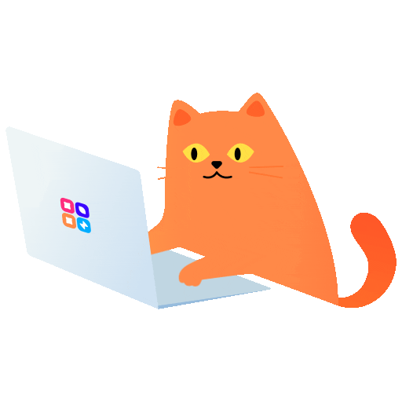
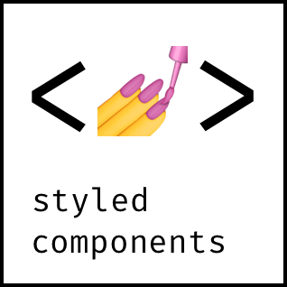

  

  <h1>Hi there 👋, I'm Ihor</h1>
  <h3>Front-end developer from Ukraine 💻</h3>

  
  
  

---

### 😎 A little about me :

- 🔥 Front-end developer with a love for crafting sleek UIs and obsessively clean code.
- 📚 Constantly leveling up — tech moves fast, and I’m sprinting to keep pace.
- ☕ My ideal coding session starts with coffee and good vibes (plus a few bugs that shouldn’t be there).😅
- 🧠 Doing my best not to **_drop dead_** in these _charming times_, balancing work, life, and self-improvement.
- 🚀 Dreaming of building an app that **_doesn't break on the first day of release_**. Well, at least I’ll try! 😅

---

### 🛠️ Tech Stack & Tools :

&nbsp;
&nbsp;
&nbsp;
&nbsp;
&nbsp;
&nbsp;
&nbsp;
&nbsp;
&nbsp;
&nbsp;
&nbsp;
&nbsp;
&nbsp;
&nbsp;
&nbsp;
&nbsp;
&nbsp;
&nbsp;
&nbsp;
&nbsp;

---

### 📊 My stat

     
     

